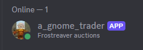
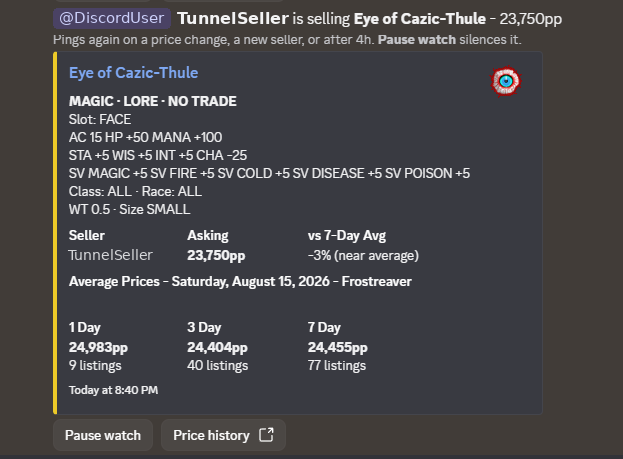
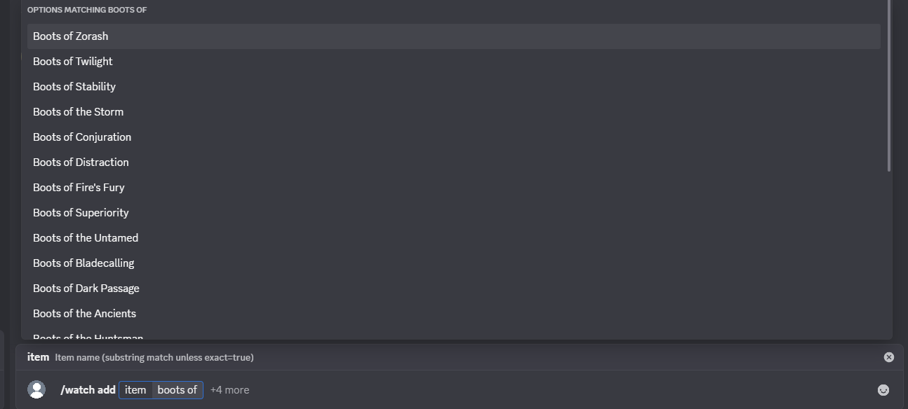
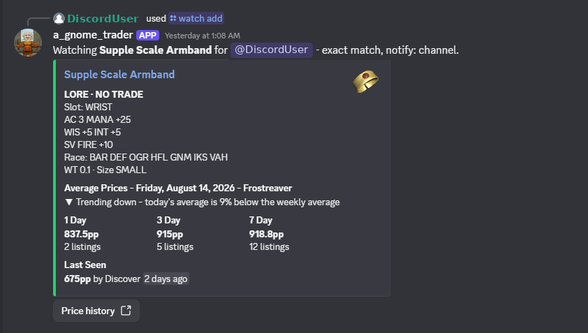
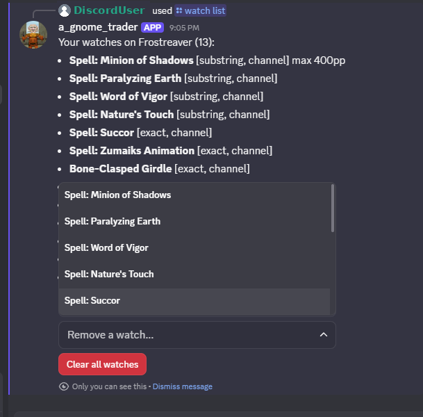

# a_gnome_trader

A Discord bot for EverQuest TLP servers that watches the Frostreaver auction feed from [TLP Auctions](https://www.tlp-auctions.com/) and pings you the moment an item you want goes up for sale, showing the seller, the asking price, and whether it's a deal. Upcoming features will add other TLP servers, but for now it's just Frostreaver.

I run and test this on my Mac Studio, so any feedback on how the Windows or Linux version works would be great!

Keep in mind that if you run the Windows version, the bot goes down and stops alerting whenever you close its window. It is really best run on a dedicated server or an always-on machine.

Green means it's priced below the 7-day average. Red means it's not.

## What it does

- **Item watches**: substring or exact match, optional max price, channel ping or DM, private watches that don't reveal what you're hunting
- **Pings**: a seller's first listing pings; the same seller re-pings only on a price change or after 4 hours, so channels stay quiet
- **Detailed info**: 1/3/7-day sell averages, last sale, trend vs the weekly average, full item stats and icon
- **Zone-bonus board**: daily auto-posted board of Frostreaver zone bonuses, with `/bonuswatch` pings when your zone rolls the bonus you want

## Adding a watch

Type and the live item catalog autocompletes:

The confirmation shows stats, current averages, and the last sale:

## Commands

- `/watch add item:<name>` accepts options `notify` (channel/DM/both), `exact`, `max_price`, and `private`
- `/watch list` / `all` / `remove` / `pause` / `resume` / `clear` / `status`
- `/bonuses` shows today's zone bonuses on demand
- `/bonuswatch add zone:<name>` picks bonus types from a dropdown, with `list` / `remove` / `clear` to manage
- `/update` forces a bonus-board refresh
- `/help` posts the full list in Discord

`/watch list` shows everything you're watching, with dropdowns to inspect or remove any watch in one click:

Notifications can be public in a channel or a private DM if it's in a shared discord and you want to keep your item hunting private.

## Setup

1. Create an application at https://discord.com/developers/applications, then under **Bot** click **Reset Token** (no privileged intents needed).
2. Under **OAuth2 > URL Generator**: scopes `bot` + `applications.commands`, permissions `Send Messages` + `Embed Links`. Open the URL and invite the bot. (You need the Manage Server permission in the Discord server to add a bot.)
3. Copy `config.example.json` to `config.json` and paste your token.
4. Run it (see below).
5. Once the bot is online, type `/help` in any channel it can see for the full command list and an explanation of how alerts work.

Config values (all optional except the token):

- `alertChannelId` / `ownerUserId`: where feed-down alerts go (channel and/or DM). To copy these ids, first turn on Discord's Developer Mode (**User Settings > Advanced > Developer Mode**). Then right-click the channel and pick **Copy Channel ID**, and right-click your own name in the member list and pick **Copy User ID**.
- `pollSeconds`: how often the bot polls (default 60, minimum 60). With very large watch lists the bot checks items in rotating batches, so each item refreshes within about 5 minutes rather than sending more requests.
- `staleAlertMinutes`: feed-down alert threshold (default 15)
- `repingHours`: same-seller-same-price quiet window (default 4)
- `dailyBonusChannelId`: channel for the zone-bonus board (empty = off)
- `bonusBoardRefreshMinutes`, `dailyPostHour` / `dailyPostMinute`: board cadence (default hourly, fresh post 3:10 AM)

## Running it

**Windows**: run it from a script or the exe directly. `run_hidden.vbs` runs it invisibly (recommended; `stop_bot.bat` stops it), `start_bot.bat` runs it in a console with auto-restart, or just double-click `a_gnome_trader.exe`. For start-at-boot, drop a shortcut to `run_hidden.vbs` in `shell:startup`.

The exe is unsigned, so the first launch of a downloaded copy triggers a SmartScreen warning ("Windows protected your PC"). Click **More info**, then **Run anyway**. This appears once per download and is expected for small unsigned programs.

**macOS**: open Terminal and paste:

    curl -fsSL https://raw.githubusercontent.com/Lisa-Mays/a_gnome_trader/main/deploy/install-mac.sh | bash

The script detects the chip, downloads the right binary from the latest release into `~/a_gnome_trader`, clears the quarantine flag, and starts the setup wizard. The wizard walks through everything else and can set the bot to start by itself at login, or at boot before anyone logs in, restarting after any crash. To manage an automatic-start bot:

- Watch the log: `tail -f ~/a_gnome_trader/bot.log`
- Stop (login style): `launchctl bootout gui/$UID/com.agnometrader.bot`
- Stop (boot style): `sudo launchctl bootout system/com.agnometrader.bot`

The binaries are unsigned, so macOS quarantines a hand-downloaded copy and refuses to run it ("cannot be opened because the developer cannot be verified"). The install script clears this automatically; if you download the binary yourself, clear it with `xattr -d com.apple.quarantine ./a_gnome_trader-macos-arm64` or approve it under **System Settings > Privacy & Security > Open Anyway**.

**Linux**: copy the linux binary, `config.json`, and `itemdb/` to `/opt/a_gnome_trader/`, create the service user (`sudo useradd -r agnome && sudo chown -R agnome /opt/a_gnome_trader`), install `deploy/a_gnome_trader.service` into systemd, then `sudo systemctl enable --now a_gnome_trader`.

Binaries build from one codebase for Windows, macOS (Intel/Apple Silicon), and Linux (amd64/arm64): `go build` in `src/`. Run the bot in exactly one place at a time or users get duplicate alerts.

## Item stats and icons

The included `itemdb/` folder gives every card its in-game EverQuest tooltip (MAGIC/LORE/NO TRADE, slot, stats, resists, effects, class/race) plus the item icon, all read locally at startup with no network involved. The database currently covers Classic, Kunark, and Velious era items. If a record is ever wrong, drop a corrected one into `itemdb/overrides.json` (create it if needed) and restart; overrides win over the base data.

## Data source and fair use

Auction data comes from the TLP Auctions API (araduneauctions.net), which tracks auctions on EverQuest Time-Locked Progression servers; it is free for personal, non-commercial use under the PolyForm Noncommercial license. The bot uses the API's recommended bulk watchlist endpoints, honors rate limits, and checks watched items in small rotating batches (at most a few requests per minute, no matter how many items are watched) so each item is refreshed about as often as the site's own 5 minute cache updates. Alerts typically land within a few minutes of a listing. Zone bonuses come from frostreaver.zone. Do not use this bot or its data commercially.

## License

This bot's source code is released under the same [PolyForm Noncommercial 1.0.0](https://polyformproject.org/licenses/noncommercial/1.0.0) license as its data source: free for personal and noncommercial use, no commercial use. See [LICENSE](LICENSE).
